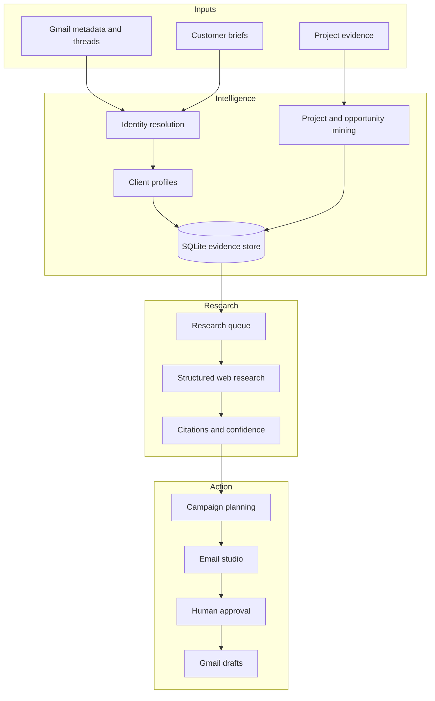

# Email Intelligence Workbench

**A private growth-operations console that converts customer email history, project evidence and structured research into reviewable actions.**

`Python` · `SQLite` · `Gmail API` · `Research Automation` · `Human-in-the-loop`

## At a glance

| | |
|---|---|
| **Business problem** | Customer knowledge was fragmented across inboxes, briefs and project files |
| **Primary user** | Growth operator researching accounts and preparing campaigns |
| **System role** | Unify evidence, surface opportunities and coordinate reviewed outreach |
| **AI role** | Structured business research, synthesis and draft assistance |
| **Control model** | Evidence citations, exclusions, approvals and draft-only delivery |

## The problem

An inbox contains more than messages: it contains relationship history,
commercial intent, delivery evidence, unresolved risks and potential next steps.
However, that information is difficult to search and nearly impossible to use
consistently across thousands of conversations.

I designed this workbench to turn dispersed customer evidence into an operating
system for account research, opportunity discovery and controlled outreach.

## How it works

## Core capabilities

- Indexes Gmail metadata using read-only access
- Builds unified client profiles across briefs, messages and projects
- Resolves identity matches and exposes their confidence for review
- Prioritizes replies, follow-ups, commercial conversations and delivery risks
- Suppresses newsletters, auto-replies, bounces and low-value system traffic
- Mines project threads and attachments for delivery evidence
- Detects workflow opportunities grounded in customer-authored messages
- Queues structured business research with citations and confidence
- Plans campaign segments, touches and outcome states
- Previews, edits and approves premium email variants
- Creates Gmail drafts without automatic sending
- Tracks operational outcomes without claiming automatic attribution

## AI implementation

AI is used for research synthesis, opportunity framing and draft assistance.
Identity resolution, exclusions, workflow state, risk gates and Gmail delivery
boundaries remain deterministic and reviewable.

## Technology stack

| Layer | Technology |
|---|---|
| Backend | Python and standard-library HTTP services |
| Data | SQLite |
| Interface | HTML, CSS and vanilla JavaScript |
| Email | Gmail API with separate read and compose permissions |
| Research | Structured research jobs with evidence and citations |
| Inputs | Gmail, structured form exports and project artifacts |
| Testing | Python unit tests and database integrity checks |

## Key design decisions

1. Separate mailbox reading from compose authorization.
2. Preserve source evidence so conclusions remain auditable.
3. Require public evidence before research becomes an outreach claim.
4. Treat risk and exclusion rules as gates, not soft AI suggestions.
5. End every automated communication workflow at a reviewable Gmail draft.

## My contribution

I defined the operating model, connected customer and project evidence into a
single workflow, designed the research and approval stages, and directed the
AI-assisted implementation and testing of the system.

## Further documentation

- [Architecture](docs/architecture.md)
- [Capabilities](docs/capabilities.md)
- [Design decisions](docs/design-decisions.md)
- [Evidence and claim boundaries](docs/evidence.md)
- [Fictional workflow](examples/fictional-workflow.md)

## Public repository boundary

This sanitized case study excludes customer identities, messages, credentials,
research reports, campaign content, databases, private URLs and original source.

